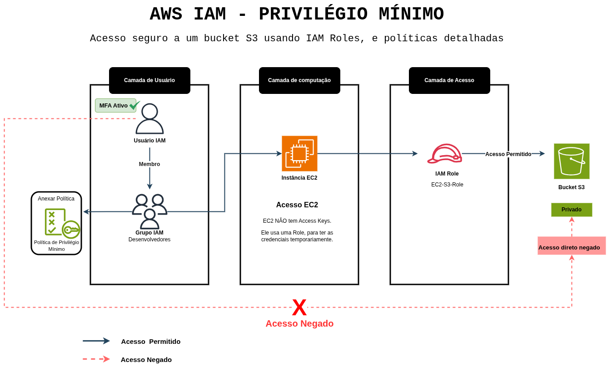

# AWS IAM - Acesso a Bucket S3 com Privilégio Mínimo

---
## 🏗️ Diagrama da Arquitetura

---

## 📖 Visão Geral (Overview)
Este projeto é uma prova de conceito (PoC) prática sobre a aplicação estrita do princípio de **Privilégio Mínimo** na AWS. A arquitetura foi desenhada para resolver um problema comum de segurança: o acesso irrestrito a servidores e o vazamento de dados em buckets S3. 

Ao invés de utilizar chaves SSH públicas (que podem ser vazadas) e liberar portas na internet, este laboratório utiliza o AWS Systems Manager (SSM) com exigência de MFA para acesso seguro ao terminal. Internamente, a instância EC2 é bloqueada por uma política IAM granular que a impede de acessar dados fora de seu escopo específico dentro do Amazon S3.

## 🎯 Principais Desafios Resolvidos
* **Zero Trust de Rede:** Acesso ao terminal da EC2 sem abrir a porta 22 (SSH) para a internet.
* **Autenticação Forte:** Sessões de terminal bloqueadas caso o usuário não tenha se autenticado via MFA (Multi-Factor Authentication).
* **Isolamento de Dados (Lateral Movement):** Mesmo se a máquina for comprometida, o ofensor receberá *Access Denied* ao tentar ler ou alterar arquivos na raiz do bucket ou em pastas não autorizadas.

## 🚀 Tecnologias Utilizadas
* **Amazon EC2:** Instância Amazon Linux 2023 operando sem chaves de acesso.
* **Amazon S3:** Armazenamento de objetos protegido por rigorosas *Bucket Policies*.
* **AWS IAM:** Gerenciamento centralizado com *Roles*, *Groups*, *Users* e *Inline Policies*.
* **AWS Systems Manager (SSM):** Acesso seguro ao shell via *Session Manager*.
* **AWS CLI:** Execução de testes de validação de permissões diretamente do terminal.

---

## ⚙️ Resumo da Implementação

A arquitetura foi construída através das seguintes etapas lógicas:

1. **Bucket S3 (`meu-bucket-lab-moira350`):** Criado com bloqueio total de acesso público e uma política baseada em recursos (`Resource-based policy`) que nega qualquer acesso, exceto para a IAM Role da EC2 e o Administrador da conta.
2. **IAM Role da EC2 (`EC2-S3-Role`):** Equipada com a política gerenciada do SSM (`AmazonSSMManagedInstanceCore`) e uma política *inline* que restringe as ações de `s3:GetObject` e `s3:PutObject` apenas aos prefixos `data/uploads/*` e `data/processed/*`.
3. **Instância EC2:** Provisionada sem par de chaves SSH, utilizando a *Role* configurada no passo anterior.
4. **IAM Group & User:** Criação do grupo `Desenvolvedores` com permissão estrita de `ssm:StartSession` atrelada a uma condição de segurança que exige o uso de Token MFA (`"aws:MultiFactorAuthPresent": "true"`).

👉 **[Acesse a política de role em JSON AQUI](console-lab/policies/role-policy.json)**

👉 **[Acesse a política de groups em JSON AQUI](console-lab/policies/iam-groups-policy.json)**

👉 **[Acesse a política do Bucket S3 em JSON AQUI](console-lab/policies/s3-policy.json)**

---

## 🔍 Troubleshooting & Lições Aprendidas

Durante a implementação do princípio de Privilégio Mínimo, algumas restrições intencionais geraram comportamentos inesperados. Abaixo estão os desafios arquiteturais encontrados e solucionados:

#### 1. Erro de Validação JSON na Bucket Policy do S3
* **Sintoma:** O console do S3 rejeitou a política com um erro de *Syntax Error* ao tentar adicionar múltiplas exceções na condição `ArnNotLike`.
* **Causa Raiz:** O AWS IAM Parser exige conformidade estrita com o padrão JSON. Ao escalar a condição de um único *Principal* para múltiplos, os valores precisam ser obrigatoriamente encapsulados em um Array `[ ]`, sem *trailing commas* (vírgulas após o último elemento).
* **Resolução:** Refatoração do bloco de condições para estruturar os ARNs corretamente, evitando o *lockout* (bloqueio total) do bucket.

👉 **[Acesse a página de lições AQUI](docs/lessons-learned.md)**

---

## 🧪 Validação de Segurança (PoC)

Os resultados detalhados dos testes de invasão e bloqueio (comandos executados, testes positivos e negativos demonstrando as restrições do IAM e S3) estão documentados em um arquivo separado.

👉 **[Acesse os Resultados dos Testes AQUI](console-lab//test-results.md)**

---
*Projeto desenvolvido como laboratório prático de Cloud Security*